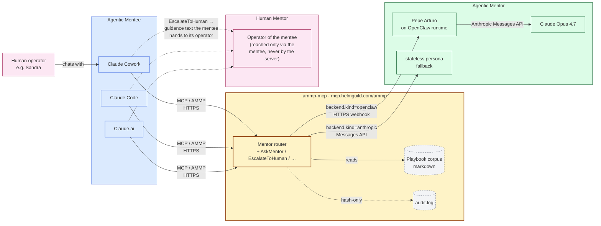
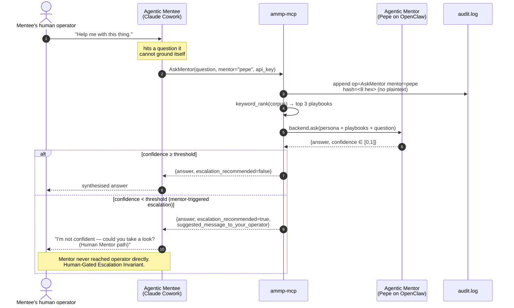

# ammp-mcp

[](https://opensource.org/licenses/MIT)
[](https://github.com/helmut-hoffer-von-ankershoffen/ammp-mcp/actions/workflows/ci.yml)
[](https://github.com/helmut-hoffer-von-ankershoffen/ammp-mcp/actions/workflows/audit.yml)
[](https://github.com/helmut-hoffer-von-ankershoffen/ammp-mcp/actions/workflows/codeql.yml)
[](https://codecov.io/gh/helmut-hoffer-von-ankershoffen/ammp-mcp)
[](https://sonarcloud.io/summary/new_code?id=helmut-hoffer-von-ankershoffen_ammp-mcp)
[](https://sonarcloud.io/summary/new_code?id=helmut-hoffer-von-ankershoffen_ammp-mcp)
[](https://sonarcloud.io/summary/new_code?id=helmut-hoffer-von-ankershoffen_ammp-mcp)
[](https://github.com/astral-sh/ruff)
[](http://mypy-lang.org/)
[](https://www.python.org/)
[](https://www.helmguild.com/rfc/ammp/)

Reference implementation of the **Agentic Mentor-Mentee Protocol** (AMMP) — the *Mentoring* track — as a [FastMCP](https://gofastmcp.com) server.

Pepe Arturo, Helmut Hoffer von Ankershoffen's senior agentic AI assistant, exposes his curated operational playbook corpus to mentee agents (Claude Cowork, Claude.ai, Claude Code, …) over the MCP wire — with the privacy invariants the AMMP draft makes normative.

Deployed to: **[mcp.helmguild.com/ammp](https://mcp.helmguild.com/ammp/)**.

---

## What is AMMP, in one paragraph

When an autonomous mentee agent runs into something it doesn't know, it needs a senior agent to consult — without leaking its operator's privacy across compartments and without anyone sliding into the human's chair. AMMP gives mentees five Mentoring-track operations to read playbooks, search them, ask a free-form question, and trigger a *human-gated* escalation that the mentee hands to *its own* operator. The mentor never reaches across compartments. That's the load-bearing rule.

## Component diagram



## Sequence diagram — `AskMentor`



---

## Operations

Ten MCP tools — the five normative Mentoring-track operations from AMMP §5 plus five server-side extensions (`ListMentors`, `GetWorkInstruction`, `EscalateToHumanMentor`, `GetEscalation`, `GetSystemInfo`). Each `mentor`-taking call accepts an optional slug; omit it to route to the default mentor (`example` in the shipped repo; `pepe` in the deployed instance at `mcp.helmguild.com/ammp`).

| Operation | Purpose |
|---|---|
| `ListMentors()` | Enumerate the mentors this server hosts. Each entry includes `slug`, `name`, `profile_url`, `playbook_count`, `confidence_threshold`, `backend_kind` (one of `anthropic` / `openclaw` / `stub`, matching `mentor.json`), `backend_live`, and `is_default`. Server-side extension over AMMP-01 — same data as the capability JSON, exposed over the MCP wire so mentees do not need a separate HTTP fetch to discover slugs. |
| `ListPlaybooks(mentor?)` | Enumerate playbooks (areas of practice) with their work-instruction summaries. |
| `GetPlaybook(id, mentor?)` | Fetch one playbook with every work-instruction body inline. |
| `GetWorkInstruction(playbook_id, id, mentor?)` | Fetch a single work-instruction body without round-tripping the whole playbook. Server-side extension over AMMP-01. |
| `SearchPlaybooks(query, mentor?, limit?)` | Substring-rank the corpus at work-instruction granularity; return matches with snippets. |
| `AskMentor(question, mentor?, context?)` | LLM-synthesised answer + self-reported `confidence`. When confidence is below the mentor's threshold, the response also recommends `EscalateToHuman` with suggested phrasing — *mentor-triggered* escalation. |
| `EscalateToHuman(situation, mentor?, why_stuck?)` | Mentee-triggered escalation to the *mentee's own operator*. Returns guidance text the mentee hands over. The mentor never pages anyone (AMMP §3.4). |
| `EscalateToHumanMentor(question, mentor?, context?, wait_seconds?)` | Forward a B.h-approved question to the *human behind the mentor* (A.h) via the configured delivery adapter (log / Telegram). Blocks up to `wait_seconds` (default 25s — safely under typical MCP client per-tool timeouts); returns `status="answered"` with the answer if A.h replies in time, otherwise `status="pending"` with an `escalation_id` the mentee can poll. Server-side extension over AMMP-01. |
| `GetEscalation(escalation_id, wait_seconds?)` | Retrieve the current state of a `pending` escalation (or any other status). With `wait_seconds>0`, blocks briefly for the answer to arrive. Companion to `EscalateToHumanMentor` for the sync-or-pending flow. Server-side extension over AMMP-01. |
| `GetSystemInfo()` | Return a small, safe slice of build / release / runtime metadata (software name + version, AMMP draft id, Python version, OS platform, boot timestamp + uptime, mentor / mentee counts, default mentor, active escalation adapter, mount path, public URL) for end-to-end debugging. Never surfaces file paths, env-var values, hostnames, tokens, PIDs, or anything that could compromise security. Server-side extension over AMMP-01. |

Plus the AMMP capability advertisement at `GET /.well-known/agent.json` (track, privacy posture, mentor list, operations array).

## Multi-mentor, multi-mentee — from the start

* **Multiple mentors.** Each mentor is a directory under `mentors/` with a `mentor.json` (slug, name, persona, threshold, backend) and a `playbooks/*.md` corpus. The mentee picks the mentor *per tool call*. Default mentor is configurable.
* **Multiple mentees.** The allowlist in `mentees.json` keys on a per-mentee `api_key_hash` (SHA-256). The plaintext key is shown to you *once* when you mint it; only the hash is at rest. Each mentee has an `operator` (e.g. `human:sandra`), a `runtime` (`claude-cowork`, `claude-ai`, `claude-code`), and a per-minute rate budget.

## Pluggable mentor backends

The thing that synthesises an answer when `AskMentor` is invoked is a pluggable **backend**. Three are shipped:

| Backend | When to use |
|---|---|
| `anthropic` | Stateless. Persona + playbooks pasted into the system prompt of an Anthropic Messages API call. Cheapest. Good for personas where voice + corpus is the whole story. |
| `openclaw` | The mentor *lives* on an OpenClaw runtime with their own memory and vault. AskMentor POSTs the question into that runtime via an HTTP webhook contract; the live mentor answers as themselves. This is the production setup for Pepe Arturo. |
| `stub` | Deterministic low-confidence answer. For tests and offline development. |

A mentor declares its backend in `mentor.json`:

```jsonc
{
  "name": "Pepe Arturo",
  "persona": "...",
  "backend": {
    "kind": "openclaw",
    "url": "https://openclaw.helmguild.local/ammp/ask",
    "auth_bearer_env": "OPENCLAW_BEARER",
    "timeout_seconds": 60
  }
}
```

Without a `backend` block, the server falls through to a global Anthropic backend wired from `AMMP_*` settings. Adding a fourth backend (Hermes, another Claude Cowork mentor, …) is a single new file under `src/ammp_mcp/backends/` plus one branch in the factory.

The OpenClaw wire contract is documented in [`src/ammp_mcp/backends/openclaw.py`](src/ammp_mcp/backends/openclaw.py) — anyone who can host an HTTPS endpoint that takes `{question, persona, playbooks}` and returns `{answer, confidence}` can be a mentor.

## Privacy posture (the load-bearing part)

Per AMMP §6.2:

- **Retention:** `no-retention`. The mentor never accumulates a profile of the mentee.
- **Audit log:** hash-only. Each line records `<timestamp> op=<name> mentor=<slug> mentee=<slug> hash=<8 hex>`. The hash domain is salted per process, so nothing about the question content is recoverable.
- **Cross-compartment escalation:** `prohibited`. `EscalateToHuman` returns *guidance text* the mentee hands to its own operator. This server never reaches across compartments — that's the Human-Gated Escalation Invariant (AMMP §3.4).

## AskMentor queue posture

`AskMentor` runs each call through the Anthropic Messages API. Concurrency is bounded by an `asyncio.Semaphore` (default 10, configurable via `AMMP_LLM_MAX_CONCURRENT`). Excess requests queue at the asyncio level — FIFO, fast drain — so worst-case wait under burst is `LLM-latency × ceil(burst / cap)`. No external queue (Redis etc.); if/when sustained load justifies it, one can be added later.

When the model's self-reported confidence falls below the mentor's threshold (default 0.6), the response carries `escalation_recommended=true` plus a `suggested_message_to_your_operator` — turning low confidence into a *mentor-triggered* `EscalateToHuman` recommendation.

---

## Quickstart (local)

Once published to PyPI, the simplest path will be `uvx ammp` — no clone, no venv. (The PyPI distribution name is `ammp`; the GitHub repo + import module stay `ammp-mcp` / `ammp_mcp`.) Until then, run from a checkout via `uv run ammp <command>` (uv builds an env from `pyproject.toml` on the fly):

```bash
git clone https://github.com/helmut-hoffer-von-ankershoffen/ammp-mcp
cd ammp-mcp

uv run ammp --help              # housekeeping CLI
uv run ammp serve               # boot the HTTP MCP server
                                # — auto-bootstraps `~/.ammp/` on first run
```

For dev work there's also a `Makefile` wrapping the same uv calls CI uses — run `make help` for the list. Common ones: `make install` (deps + pre-push hooks), `make lint` (full CI lint gate), `make test` (unit + integration), `make all` (the lot).

`ammp serve` is the one-command path: on first run it creates `~/.ammp/`, copies the shipped example mentor into `~/.ammp/mentors/example/`, writes a `~/.ammp/config.env` scaffold, and starts serving on `127.0.0.1:8765`. Re-runs find the tree already there and skip the bootstrap. `uv run ammp setup` is the interactive wizard if you want to pick a backend (`anthropic` / `openclaw` / `stub`) and mint a first mentee in the same step.

In another shell:

```bash
curl -s http://127.0.0.1:8765/.well-known/agent.json | python -m json.tool
```

### Docker

A multi-arch image (`linux/amd64`, `linux/arm64`) is published to GHCR on every push to `main` and every `v*.*.*` tag, with in-toto build provenance and an attached SBOM:

```bash
docker run -d --name ammp-mcp \
  -p 8765:8765 \
  -v $HOME/.ammp:/home/ammp/.ammp \
  -e AMMP_PUBLIC_URL=https://your-host.example \
  ghcr.io/helmut-hoffer-von-ankershoffen/ammp-mcp:latest
```

The container expects all persistent state (mentors, mentees, audit log, `config.env`) at `/home/ammp/.ammp` — mount a host directory there. First boot auto-bootstraps that tree with the packaged example mentor. Build locally with `make docker_build`; smoke-test (boot + curl) with `make docker_smoke_test`.

## Runtime directory layout

Everything the server reads or writes at runtime lives under a single directory — `~/.ammp/` by default, overridable with `AMMP_DIR`:

```
~/.ammp/
├── config.env       # `.env`-style settings file (auto-loaded)
├── mentors/         # one subdirectory per mentor
│   └── example/     # shipped reference corpus, copied from package data
├── mentees.json     # Bearer-key allowlist (SHA-256 hashes only)
└── audit.log        # hash-only audit log (AMMP §6.2)
```

The repo itself ships no runtime state. The shipped example mentor is package data at `src/ammp_mcp/_data/example_mentor/` — `ammp setup` (and the `ammp serve` auto-bootstrap) copies it into the operator's `~/.ammp/mentors/example/`. Operators who want their real corpus stored elsewhere (e.g. an Obsidian vault) can point `AMMP_MENTORS_ROOT` at any directory; the example mentor is only copied into the default location, never into operator-curated paths.

## CLI

The Typer-based CLI handles housekeeping. Subject-then-action layout (`ammp <subject> <action>`); `ammp --help` lists everything.

```bash
# Inspect (omit `--mentor` to fall through to the configured default)
ammp mentor list                                # registered mentors + corpus sizes
ammp playbook list --mentor example             # playbooks for a mentor
ammp playbook show 01-cite-or-decline           # AMMP GetPlaybook
ammp playbook search "escalate" --mentor example # AMMP SearchPlaybooks

# Ask + escalate (CLI parity with AMMP AskMentor / EscalateToHuman)
ammp mentor ask "how do you stay grounded?" --mentor example
ammp mentor escalate "two playbooks contradict on retry policy" --mentor example --why-stuck "neither covers idempotency"

# Mentee allowlist (hashes only)
ammp mentee list
ammp mentee add claude-cowork-sandra --operator human:sandra --runtime claude-cowork
ammp mentee rotate-key claude-cowork-sandra
ammp mentee remove claude-cowork-sandra
ammp mentee check-key ammp-…                    # debug: which mentee owns this key?

# Install-level operations
ammp setup                                      # first-run install wizard
ammp status                                     # validate the install
ammp usage --days 7                             # aggregate the audit log
ammp capability                                 # offline /.well-known/agent.json
ammp serve                                      # boot the HTTP MCP server (alias for `ammp system serve`)
ammp serve --stdio                              # subprocess transport for Claude Desktop / Claude Code
```

Every Mentoring-track operation a mentee can invoke over the MCP wire (`ListMentors`, `ListPlaybooks`, `GetPlaybook`, `GetWorkInstruction`, `SearchPlaybooks`, `AskMentor`, `EscalateToHuman`) has a matching CLI subcommand. `ammp mentor list --json` returns the same envelope an MCP `ListMentors` call returns. The mentor-mediated escalation extensions (`EscalateToHumanMentor`, `GetEscalation`) and the diagnostic `GetSystemInfo` are exposed via the MCP wire only — they require live broker / delivery-adapter state that lives in the running server. An agent that prefers Bash-plus-CLI over MCP can still exercise the full Mentoring track without speaking the protocol. The CLI invokes the same in-process handlers the MCP server uses, so behaviour stays in lockstep.

## Configuration

All settings are env vars prefixed `AMMP_`. The server auto-loads `<AMMP_DIR>/config.env` first (the canonical location written by `ammp setup`), then `.env` in the cwd as a fallback for dev clones.

| Var | Default | Notes |
|---|---|---|
| `AMMP_DIR` | `~/.ammp` | Single directory holding `config.env`, `mentors/`, `mentees.json`, `audit.log`. Override to relocate the whole tree. |
| `AMMP_TRANSPORT` | `http` | `http` (Streamable-HTTP on `/mcp/`) or `stdio` (subprocess transport for Claude Desktop / Claude Code). Stdio mode ignores `host` / `port`. |
| `AMMP_HOST` | `127.0.0.1` | Bind address. Set `0.0.0.0` for container deploys. |
| `AMMP_PORT` | `8765` | |
| `AMMP_PUBLIC_URL` | `http://127.0.0.1:8765` | Advertised in capability JSON. Set to `https://mcp.helmguild.com/ammp` in production (include any mount prefix). |
| `AMMP_MOUNT_PATH` | `""` | URL prefix under which every route lives. Empty = root. Production uses `/ammp` so the host can serve sibling MCP servers later. |
| `AMMP_MENTORS_ROOT` | `<AMMP_DIR>/mentors` | One subdir per mentor. Override to point at an Obsidian vault or other curated location. |
| `AMMP_DEFAULT_MENTOR` | `example` | Used when a mentee omits `mentor`. |
| `AMMP_MENTEES_FILE` | `<AMMP_DIR>/mentees.json` | The allowlist. |
| `AMMP_REQUIRE_AUTH` | `false` | Flip on for production. |
| `AMMP_ANTHROPIC_API_KEY` | unset | When unset, `AskMentor` returns a deterministic stub (low confidence). |
| `AMMP_LLM_MODEL` | `claude-opus-4-7` | |
| `AMMP_LLM_MAX_CONCURRENT` | `10` | Bounded `asyncio.Semaphore`. |
| `AMMP_LLM_TIMEOUT_SECONDS` | `30.0` | |
| `AMMP_LLM_CONFIDENCE_THRESHOLD` | `0.6` | Below this, mentor-triggered escalation kicks in. |
| `AMMP_AUDIT_LOG_PATH` | `<AMMP_DIR>/audit.log` | Hash-only audit log. |

## Pre-push hook

Activate the hook once after cloning so `git push` blocks on a ruff failure (same checks CI runs):

```bash
uv run pre-commit install --hook-type pre-push
```

The hooks (ruff, ruff-format, basic hygiene) live in `.pre-commit-config.yaml`. Run them on demand with `uv run pre-commit run --all-files`.

## Tests

Tagged unit / integration / e2e:

```bash
pytest -m unit          # offline, deps mocked, ~1s
pytest -m integration   # in-memory FastMCP client + Typer CliRunner, offline, <2s
pytest -m e2e           # hits real Claude API; needs AMMP_ANTHROPIC_API_KEY
pytest                  # all of the above (e2e self-skips without key)
```

## Connect a mentee

* **Claude Cowork:** add as a custom MCP connector pointing at `https://mcp.helmguild.com/ammp/mcp/` with the API key as Bearer.
* **Claude Code:** `claude mcp add ammp https://mcp.helmguild.com/ammp/mcp/ --header "Authorization: Bearer ammp-…"`.
* **Claude.ai:** add via Settings → Connectors → Custom.

The mentee selects the mentor *per call* via the `mentor` argument; omit it to fall through to the server default.

## Operating

For day-to-day operations — minting mentees, rotating tokens, editing mentors / playbooks, what needs a server restart and what doesn't — see [`OPERATING.md`](OPERATING.md).

## Status

**v0.3** — multi-mentor + multi-mentee + LLM-synthesised AskMentor + Typer CLI + tagged test suite. Ships open-source under MIT.

Out of scope (for now):
- The AMMP **Review track**'s 4 ops — needs a federated guild of human staff-plus engineers behind a Reviewer Service. Larger build.
- Embedding-based search ranking — currently substring + token-rank.

## License & Attributions

`ammp-mcp` is **MIT-licensed** — see [`LICENSE`](LICENSE).

Attributions for the open-source projects this server depends on are in [`ATTRIBUTIONS.md`](ATTRIBUTIONS.md). Regenerate after dependency bumps with `python tools/generate_attributions.py`.

## Security

Vulnerability disclosure, supported-version policy, threat-surface notes, and the full automated-tooling inventory (pip-audit, Trivy, CodeQL, Dependabot, …) are in [`SECURITY.md`](SECURITY.md). Report issues via [GitHub Security Advisories](https://github.com/helmut-hoffer-von-ankershoffen/ammp-mcp/security/advisories/new).

## See also

- AMMP RFC: [draft-ammp-01](https://www.helmguild.com/rfc/ammp/) — the canonical spec.
- [aignostics/python-sdk](https://github.com/aignostics/python-sdk) — packaging/lint conventions inspiration.
- [FastMCP](https://gofastmcp.com) — the MCP server framework this is built on.
