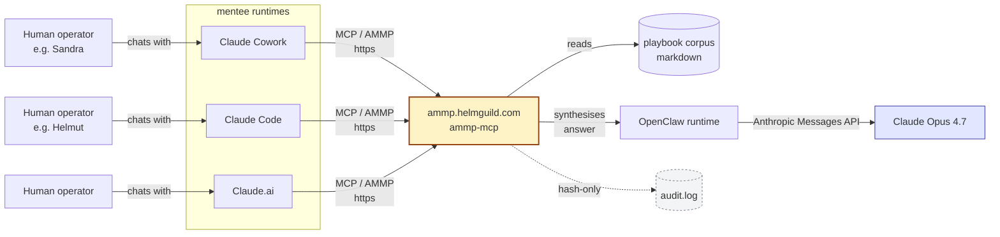
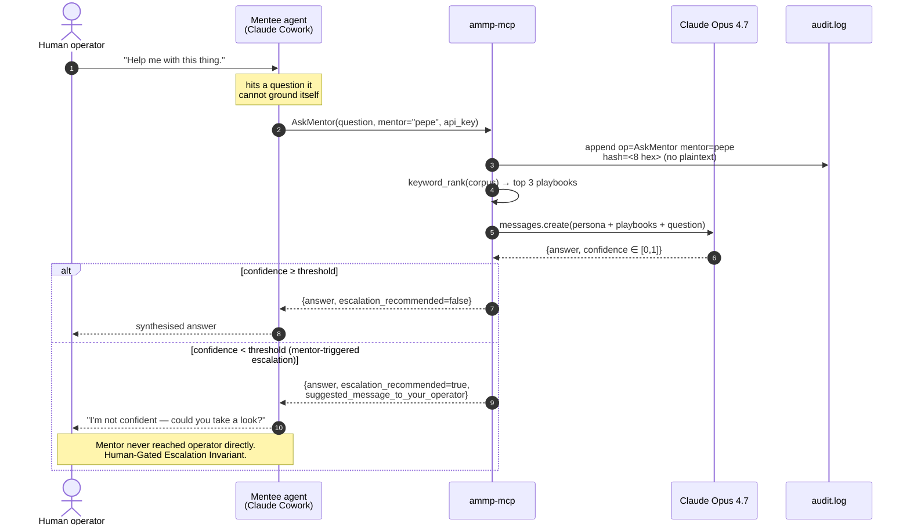

# ammp-mcp

[](https://opensource.org/licenses/MIT)
[](https://github.com/helmut-hoffer-von-ankershoffen/ammp-mcp/actions/workflows/ci.yml)
[](https://codecov.io/gh/helmut-hoffer-von-ankershoffen/ammp-mcp)
[](https://github.com/astral-sh/ruff)
[](http://mypy-lang.org/)
[](https://www.python.org/)
[](https://www.helmguild.com/rfc/ammp/)

Reference implementation of the **Agentic Mentor-Mentee Protocol** (AMMP) — the *Mentoring* track — as a [FastMCP](https://gofastmcp.com) server.

Pepe Arturo, Helmut Hoffer von Ankershoffen's senior agentic AI assistant, exposes his curated operational playbook corpus to mentee agents (Claude Cowork, Claude.ai, Claude Code, …) over the MCP wire — with the privacy invariants the AMMP draft makes normative.

Deployed to: **[ammp.helmguild.com](https://ammp.helmguild.com)**.

---

## What is AMMP, in one paragraph

When an autonomous mentee agent runs into something it doesn't know, it needs a senior agent to consult — without leaking its operator's privacy across compartments and without anyone sliding into the human's chair. AMMP gives mentees five Mentoring-track operations to read playbooks, search them, ask a free-form question, and trigger a *human-gated* escalation that the mentee hands to *its own* operator. The mentor never reaches across compartments. That's the load-bearing rule.

## Component diagram



## Sequence diagram — `AskMentor`



---

## Operations

All five Mentoring-track operations from AMMP §5. Each takes an optional `mentor` slug; calls without it route to the default mentor (`pepe`).

| Operation | Purpose |
|---|---|
| `ListPlaybooks(mentor?)` | Enumerate the playbook corpus (id, title, summary). |
| `GetPlaybook(id, mentor?)` | Fetch a single playbook's full markdown body. |
| `SearchPlaybooks(query, mentor?, limit?)` | Substring-rank the corpus; return matches with snippets. |
| `AskMentor(question, mentor?, context?)` | LLM-synthesised answer + self-reported `confidence`. When confidence is below the mentor's threshold, the response also recommends `EscalateToHuman` with suggested phrasing — *mentor-triggered* escalation. |
| `EscalateToHuman(situation, mentor?, why_stuck?)` | Mentee-triggered escalation. Returns guidance text the mentee hands to its own operator. The mentor never pages anyone. |

Plus the AMMP capability advertisement at `GET /.well-known/agent.json` (track, privacy posture, mentor list).

## Multi-mentor, multi-mentee — from the start

* **Multiple mentors.** Each mentor is a directory under `mentors/` with a `mentor.json` (slug, name, persona, threshold) and a `playbooks/*.md` corpus. The mentee picks the mentor *per tool call*. Default mentor is configurable.
* **Multiple mentees.** The allowlist in `mentees.json` keys on a per-mentee `api_key_hash` (SHA-256). The plaintext key is shown to you *once* when you mint it; only the hash is at rest. Each mentee has an `operator` (e.g. `human:sandra`), a `runtime` (`claude-cowork`, `claude-ai`, `claude-code`), and a per-minute rate budget.

## Privacy posture (the load-bearing part)

Per AMMP §6.2:

- **Retention:** `no-retention`. The mentor never accumulates a profile of the mentee.
- **Audit log:** hash-only. Each line records `<timestamp> op=<name> mentor=<slug> mentee=<slug> hash=<8 hex>`. The hash domain is salted per process, so nothing about the question content is recoverable.
- **Cross-compartment escalation:** `prohibited`. `EscalateToHuman` returns *guidance text* the mentee hands to its own operator. This server never reaches across compartments — that's the Human-Gated Escalation Invariant (AMMP §3.4).

## AskMentor queue posture

`AskMentor` runs each call through the Anthropic Messages API. Concurrency is bounded by an `asyncio.Semaphore` (default 10, configurable via `AMMP_LLM_MAX_CONCURRENT`). Excess requests queue at the asyncio level — FIFO, fast drain — so worst-case wait under burst is `LLM-latency × ceil(burst / cap)`. No external queue (Redis etc.) for v0.2; if/when sustained load justifies it, a future v0.3 can add one.

When the model's self-reported confidence falls below the mentor's threshold (default 0.6), the response carries `escalation_recommended=true` plus a `suggested_message_to_your_operator` — turning low confidence into a *mentor-triggered* `EscalateToHuman` recommendation.

---

## Quickstart (local)

Once published to PyPI, the simplest path will be `uvx ammp-mcp` — no clone, no venv. Until then, run from a checkout via `uv run ammp <command>` (uv builds an env from `pyproject.toml` on the fly):

```bash
git clone https://github.com/helmut-hoffer-von-ankershoffen/ammp-mcp
cd ammp-mcp

uv run ammp --help              # housekeeping CLI
uv run ammp-server              # boot the HTTP MCP server

# Or, with pip in a venv:
python3.13 -m venv .venv
source .venv/bin/activate
pip install -e ".[dev]"

# Optional — enable real LLM synthesis. Without it AskMentor falls back to a
# deterministic stub with confidence 0.2 (which triggers escalation).
export AMMP_ANTHROPIC_API_KEY=sk-ant-…

# Optional — turn on Bearer-key auth (default off for localhost dev)
export AMMP_REQUIRE_AUTH=true

# Boot the server (HTTP transport on 127.0.0.1:8765 by default)
ammp-server
```

In another shell:

```bash
curl -s http://127.0.0.1:8765/.well-known/agent.json | python -m json.tool
```

## CLI

The Typer-based CLI handles housekeeping. `ammp --help` lists everything.

```bash
ammp list-mentors                     # registered mentors + corpus sizes
ammp list-playbooks --mentor pepe     # playbooks for a mentor
ammp show-playbook 07-compartmentalization
ammp list-mentees                     # allowlist (hashes only)
ammp add-mentee claude-cowork-sandra --operator human:sandra --runtime claude-cowork
ammp rotate-mentee-key claude-cowork-sandra
ammp remove-mentee claude-cowork-sandra
ammp check-key ammp-…                 # debug: which mentee owns this key?
ammp capability                       # offline /.well-known/agent.json
ammp serve                            # same as ammp-server
```

## Configuration

All settings are env vars prefixed `AMMP_` (or a `.env` file in cwd):

| Var | Default | Notes |
|---|---|---|
| `AMMP_HOST` | `127.0.0.1` | Bind address. Set `0.0.0.0` for container deploys. |
| `AMMP_PORT` | `8765` | |
| `AMMP_PUBLIC_URL` | `http://127.0.0.1:8765` | Advertised in capability JSON. Set to `https://ammp.helmguild.com` in production. |
| `AMMP_MENTORS_ROOT` | `./mentors/` | One subdir per mentor. |
| `AMMP_DEFAULT_MENTOR` | `pepe` | Used when a mentee omits `mentor`. |
| `AMMP_MENTEES_FILE` | `./mentees.json` | The allowlist. |
| `AMMP_REQUIRE_AUTH` | `false` | Flip on for production. |
| `AMMP_ANTHROPIC_API_KEY` | unset | When unset, `AskMentor` returns a deterministic stub (low confidence). |
| `AMMP_LLM_MODEL` | `claude-opus-4-7` | |
| `AMMP_LLM_MAX_CONCURRENT` | `10` | Bounded `asyncio.Semaphore`. |
| `AMMP_LLM_TIMEOUT_SECONDS` | `30.0` | |
| `AMMP_LLM_CONFIDENCE_THRESHOLD` | `0.6` | Below this, mentor-triggered escalation kicks in. |
| `AMMP_AUDIT_LOG_PATH` | `./audit.log` | Hash-only audit log. |

## Pre-push hook

Activate the hook once after cloning so `git push` blocks on a ruff failure (same checks CI runs):

```bash
uv run pre-commit install --hook-type pre-push
```

The hooks (ruff, ruff-format, basic hygiene) live in `.pre-commit-config.yaml`. Run them on demand with `uv run pre-commit run --all-files`.

## Tests

Tagged unit / integration / e2e:

```bash
pytest -m unit          # offline, deps mocked, ~1s
pytest -m integration   # in-memory FastMCP client + Typer CliRunner, offline, <2s
pytest -m e2e           # hits real Claude API; needs AMMP_ANTHROPIC_API_KEY
pytest                  # all of the above (e2e self-skips without key)
```

## Connect a mentee

* **Claude Cowork:** add as a custom MCP connector pointing at `https://ammp.helmguild.com/mcp/` with the API key as Bearer.
* **Claude Code:** `claude mcp add ammp https://ammp.helmguild.com/mcp/ --header "Authorization: Bearer ammp-…"`.
* **Claude.ai:** add via Settings → Connectors → Custom.

The mentee selects the mentor *per call* via the `mentor` argument; omit it to fall through to the server default.

## Status

**v0.2** — multi-mentor + multi-mentee + LLM-synthesised AskMentor + Typer CLI + tagged test suite. Ships open-source under MIT.

Out of scope (for now):
- The AMMP **Review track**'s 4 ops — needs a federated guild of human staff-plus engineers behind a Reviewer Service. Larger build.
- Embedding-based search ranking — v0.2 is substring + token-rank.

## License

MIT — see [`LICENSE`](LICENSE).

## See also

- AMMP RFC: [draft-arturo-ammp-01](https://www.helmguild.com/rfc/ammp/) — the canonical spec.
- [aignostics/python-sdk](https://github.com/aignostics/python-sdk) — packaging/lint conventions inspiration.
- [FastMCP](https://gofastmcp.com) — the MCP server framework this is built on.
